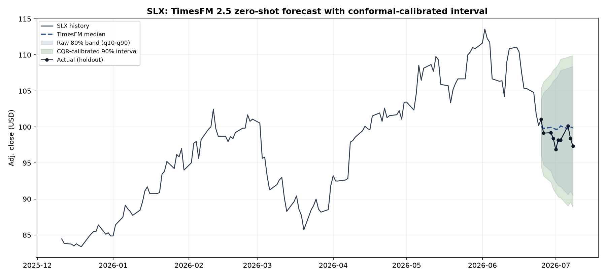
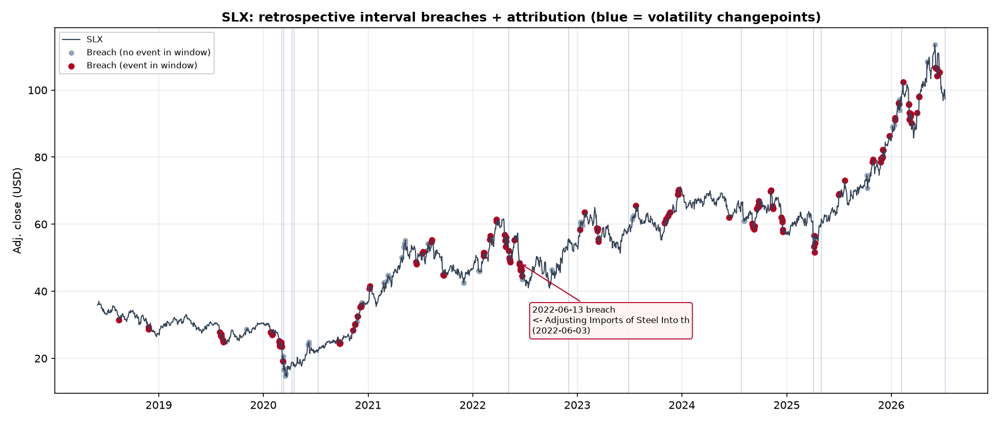
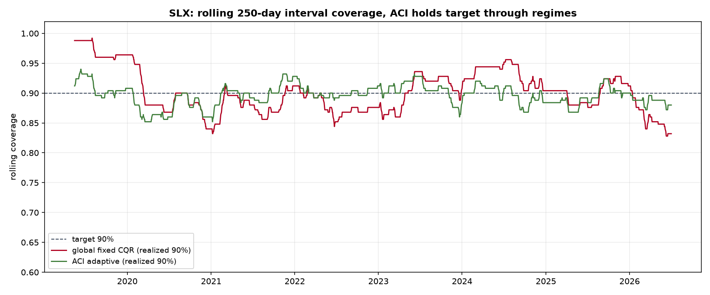
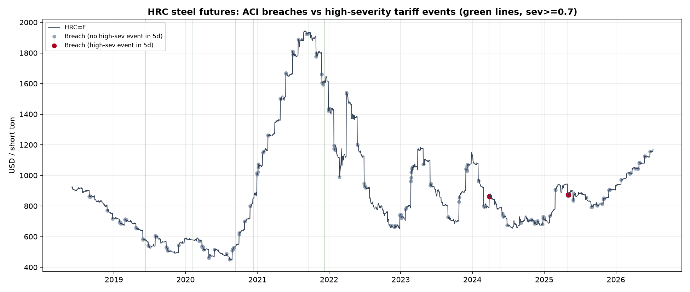

# Tariff & Geopolitical Shock Early-Warning System (EWS)

An early-warning system for tariff- and geopolitics-driven shocks in commodity and
supply-chain time series. It combines three current techniques into one pipeline:

1. **Zero-shot foundation-model forecasting** with calibrated prediction intervals.
2. **Event-informed reasoning** over tariff / policy announcements.
3. **Causal break attribution** that names the most likely driver of a move, with a
   verifiable source link.

**v1 vertical:** steel / steel-exposed sectors (HRC futures, `SLX` ETF proxy).

---

## Worked example (build-step 1: SLX, TimesFM 2.5 + CQR)

First end-to-end forecast, run on real `SLX` closes (2016-01-04 to 2026-07-08) with
**TimesFM 2.5** zero-shot and a **split-conformal (CQR)** calibrated interval.



**Interval calibration (the point of the exercise).** Across held-out rolling origins:

| Interval | Empirical coverage |
| --- | --- |
| TimesFM raw q10-q90 band (nominal 80%) | 79.2% |
| CQR-calibrated (target 90%) | 91.5% |

TimesFM's raw deciles are already close to calibrated at 80%; CQR adds a data-driven
offset of `Q = 1.55` (USD) to the band to reach the 90% target. That is what turns a
forecast into a risk signal with a coverage guarantee.

**Point accuracy (honest baseline check).** 10-business-day-ahead MASE on the test origins:

| Model | MASE |
| --- | --- |
| Seasonal-naive | 4.21 |
| ARIMA(1,1,1) | 4.22 |
| TimesFM 2.5 | 4.33 |

For a liquid, near-random-walk ETF at daily frequency, point forecasting barely beats a
random walk, and TimesFM lands marginally behind naive here. That is the expected result
and it is stated plainly: the value of this system is the **calibrated interval** and
(next) **event attribution**, not point accuracy on an efficient price series.

**Headline holdout.** Forecasting the 10 business days from 2026-06-24, the actual `SLX`
path (which fell from ~101 to ~97) stayed inside the calibrated 90% interval throughout:
**0 breaches**. A breach is exactly the signal the next build steps (event monitor plus
attribution) are designed to act on.

> Reproduce: `./.venv/Scripts/python.exe scripts/step1_forecast_slx.py`
> (all numbers in [`outputs/step1_summary.json`](outputs/step1_summary.json)).

## Worked example (build-step 2: event attribution, retrospective)

Wires real Federal Register steel-tariff proclamations to interval breaches. Over SLX
2018-2026, non-overlapping 10-day forecasts were calibrated to 90% coverage (full-sample
CQR, realized **90.1%**); the ~10% of days still outside the band are flagged as breaches
(**209 / 2110**) and each is attributed to the most likely event
(relevance x severity x recency).



**Dated, verifiable example.** The 2022-06-13 breach (SLX fell to $48.43, below the
$48.88 calibrated floor) attributes to the
[2022-06-03 "Adjusting Imports of Steel" proclamation](https://www.federalregister.gov/documents/2022/06/03/2022-12108/adjusting-imports-of-steel-into-the-united-states)
(relevance 0.64, published 10 days before the breach).

**Honest limitation (do not oversell this).** 72% of breaches had a steel-tariff event
within 14 days, but so did **66% of all scanned days**. Events are dense (255 over 8
years, concentrated in 2024-2026), so co-occurrence is largely density-driven, not strong
causal evidence. The attribution surfaces a temporally plausible, verifiable candidate
with a source link for a human to judge; it is **not** a causal identification. Sharpening
it (tighter windows, high-severity-only events, less-efficient targets like HRC futures)
is the next work. 18 volatility-regime changepoints (blue) independently mark the 2020
crash and 2022/2025 turmoil as a confidence cross-check.

> Reproduce: `./.venv/Scripts/python.exe scripts/step2_events_attribution.py`
> (all numbers in [`outputs/step2_summary.json`](outputs/step2_summary.json)).

## Gap closure (literature-backed rigor)

The gaps logged after steps 1-2 were closed with the methods the field uses, not ad-hoc
patches (see `scripts/step3_close_gaps.py`, numbers in
[`outputs/step3_gaps_summary.json`](outputs/step3_gaps_summary.json)):

| Gap | Method | Result |
| --- | --- | --- |
| Fixed offset drifts across regimes | **Adaptive Conformal Inference** (Gibbs & Candes 2021) | holds ~90% and is far more stable than a fixed offset |
| Robustness | **Frozen 2026 holdout** (untouched) | fixed CQR under-covers forward (80%), proving the drift |
| Baseline gauntlet | **GARCH(1,1)** volatility band | 87.5% holdout coverage (its adaptive width beat the fixed offset forward) |
| Is attribution real? | **Event-study permutation test** (circular-shift null) | 72.2% vs 66.0% base rate, **p = 0.134 -> not significant** |
| Point accuracy <= naive | **TSFM benchmarks** | expected on efficient daily prices; foundation models do not consistently beat random-walk |



The rolling-coverage chart is the headline: a single fixed CQR offset over-covers in calm
periods and under-covers in turbulent ones, while ACI adapts online and tracks the 90%
target through every regime.

**The most important honest finding:** the breach<->tariff-event association is **not
statistically significant** on this broad ETF (p = 0.134). Events are too dense and SLX
too diversified for co-occurrence to prove causation. This is not a failure of the method,
it is the method working: the permutation test tells us to move to a less-efficient,
more steel-pure target (HRC futures, freight rates) and high-severity-only events before
claiming attribution value. That is the next step, not a patch to this one.

## Attribution retest on HRC steel futures (pre-registered, still negative)

The prescribed retry was run on **HRC=F** (the futures contract Section 232 tariffs act
on directly) with **high-severity-only events** (rule-tagged severity >= 0.7, n = 11) and
a **pre-registered 5-day primary window**, using ACI online calibration (coverage held at
90.0%, 207 breach-days / 2060 scanned). See `scripts/step4_hrc_attribution.py`, numbers
in [`outputs/step4_hrc_summary.json`](outputs/step4_hrc_summary.json).

| Test | Hit rate | Base rate | p |
| --- | --- | --- | --- |
| **Primary: high-sev, 5d (pre-registered)** | 2.4% | 2.2% | **0.46** |
| Sensitivity: high-sev, 3/10/14d | 1.9-4.8% | 1.6-5.2% | 0.39-0.67 |
| Reference: all events, 14d | 69.6% | 66.0% | 0.25 |



**Verdict: not significant, and the primary test was fixed before looking at the data,
so this is the honest answer, not a p-hacking miss.** Two diagnoses, both documented
rather than papered over:

1. **Low power.** Only 11 high-severity events survive the filter over 8 years; with a
   2.2% base rate the test cannot detect anything but an enormous effect.
2. **Event-date mismeasurement.** The Federal Register *publication* date lags the
   market-moving *announcement*, often by 1-2 weeks (e.g. the March 2018 Section 232
   proclamation was announced on Mar 1, signed Mar 8, published Mar 15; the market moved
   on Mar 1). Daily-breach co-occurrence keyed to FR dates will therefore understate any
   true association. Fixing this requires an announcement-dated event stream (news/GDELT)
   with the Federal Register kept as the verification and severity anchor, exactly the
   two-source design already scaffolded in `src/data/events.py` (news is stubbed for v2).

**Consequence for the system's claims:** attribution is shipped as *verifiable candidate
surfacing* (a temporally plausible event with a source link for a human to judge), and
the causal early-warning claim is explicitly deferred until announcement-dated events
exist. The permutation harness stays in place as the gate any future claim must pass.

---

## How it works

```
numeric series --> TimesFM 2.5 (zero-shot) --> CQR conformal --> calibrated interval
                                                                          |
event stream  --> embeddings + severity tags --> relevance/timing --------+
                                                                          v
     actual breaches interval?  -->  changepoint cross-check  -->  attribution --> alert
```

The full design (use cases, data sources, model trade study, architecture, evaluation
plan, risk register) lives in [`docs/Tariff_Shock_EWS_Solution_Design.xlsx`](docs/Tariff_Shock_EWS_Solution_Design.xlsx).

## Repository layout

```
config/    per-vertical configuration (steel.yaml)
src/data/  ingestion: prices, trade volumes, events
src/forecast/  TimesFM 2.5 zero-shot forecast + conformal (CQR) calibration
src/events/    event embedding, severity tagging, attribution
src/detect/    changepoint detection (cross-check)
src/eval/      rolling-origin backtest + event early-warning evaluation
src/pipeline.py  orchestrates forecast -> monitor -> attribute -> alert
notebooks/  case-study demo
data/       gitignored raw + parquet cache
outputs/    generated figures
```

## Getting started

```bash
# Python 3.11+
pip install -e .            # or: uv pip install -e .
cp .env.example .env        # add FRED_API_KEY, CENSUS_API_KEY (both free)
python -m src.pipeline --config config/steel.yaml
```

## Data sources (all free / public)

| Layer            | Source                                             | Access                    |
|------------------|----------------------------------------------------|---------------------------|
| Target series    | Steel HRC futures / `SLX` ETF proxy                | `yfinance`                |
| Macro            | FRED (steel PPI, industrial production, USD index) | `fredapi` + free key      |
| Trade volumes    | US Census trade (HS 72xx)                          | Census API + free key     |
| Shipping cost    | Freightos Baltic Index / Baltic Dry proxy          | free tier                 |
| Events (anchor)  | Federal Register (Section 232/301, USTR, Commerce) | Federal Register API      |
| Events (supp.)   | News headlines                                     | GDELT / NewsAPI free tier |

The **Federal Register API** is the anchor: free, structured JSON, timestamped, and
queryable by agency + keyword, which makes attribution auditable rather than hand-wavy.

## Limitations

- v1 is a **single vertical (steel)**, daily cadence, offline backtest. No live
  alerting infrastructure and no intraday data.
- The forecast + event fusion is **decoupled, not end-to-end trained**, chosen for
  interpretability and low compute; a jointly-trained multimodal model is a v2 idea.
- Attribution is a ranking heuristic (relevance x severity x recency), not a causal
  identification guarantee; it always surfaces a source link for human verification.
- News feeds are noisy; the system anchors on the Federal Register and uses news only
  to supplement.
- Nothing here constitutes trading or investment advice.

## License

MIT (see [`LICENSE`](LICENSE)).
